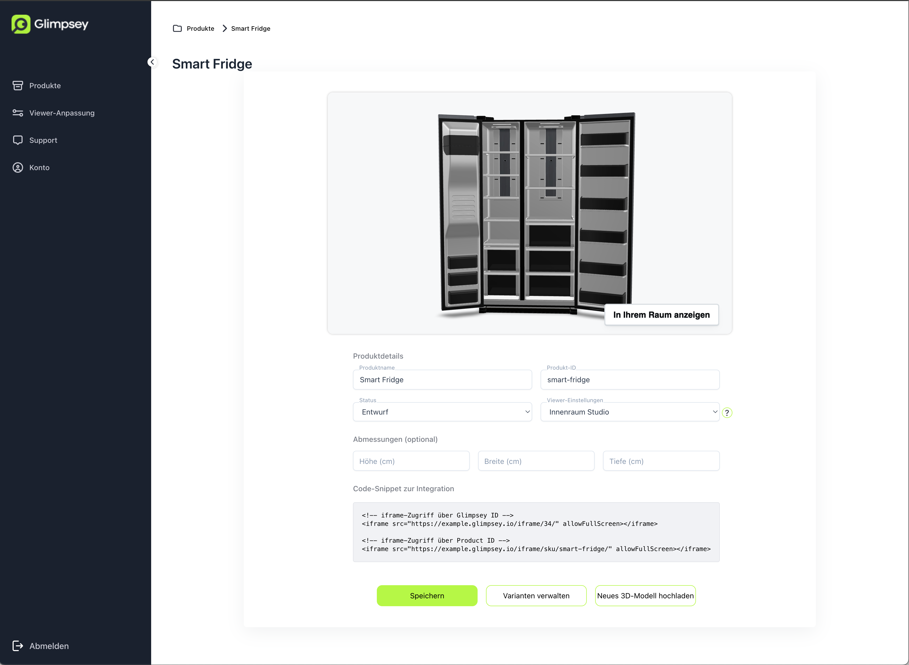

# Shop-Integration
Auf unserer Produkt-Detail-Seite im Backoffice haben wir im untersten Abschnitt _Code-Snippet zur Integration_ alles, was wir für unsere Integration benötigen.

Hier sind zwei iframe-HTML-Snippets (bzw. nur eins, wenn man keine Produkt-ID vergeben hat. Dies kann aber jederzeit nachgeholt werden) zu finden.

Das erste ist für den Zugriff über die interne Glimpsey-ID. Diese ist eigentlich nur sinnvoll, wennn man nur 1-2 Produkte auf der Website hat. Wenn man mehr hat, sollte man über 
die Produkt ID gehen. 

Dieser Zugriff über die Produkt-ID erlaubt, die Viewer-URL zu generieren, da sie immer das Format `https:://<deinUnternehmen>.glimpsey.io/iframe/sku/<Produkt-ID>/` hat.

Diese Viewer-URL kann entweder, wie im Snippet, als iframe eingebunden werden. Oder direkt als Fullscreen-Viewer aufgerufen werden. Der Viewer passt sich dabei immer den Platzverhältnissen an, die ihm zugewiesen werden.
Wenn der Viewer also in einen bestehenden Container eingepasst werden soll, muss die Größe des iframes nur über CSS entsprechend gestylt werden.

## Die Viewer-URL weiter anpassen
Die Viewer-URL unterstützt noch eine Reihe von URL-Parametern:

| Parameter      | Beschreibung                             |
|----------------|------------------------------------------|
| tId=\<userId>  | Google Analytics User-ID                 |
| startInAr=true | Versucht, direkt den AR-Modus zu starten |

_tId_ wird benötigt, um die [Google Analytics-Integration](tracking.md) zu nutzen. Hiermit wird die User-Id des aktuellen Nutzers übergeben.

_startInAr=true_ versucht, direkt den AR-Modus zu starten. Da einige Browser dies nicht ohne Nutzer-Interaktion erlauben, 
wir bei einem Fehlversuch der 3D-Viewer angezeigt und der Nutzer muss selbst noch ein den "Im Raum anzeigen"-Button klicken.
Wenn kein AR auf dem Gerät verfügbar ist, wird der normale AR-Fallback-Dialog angezeigt.
