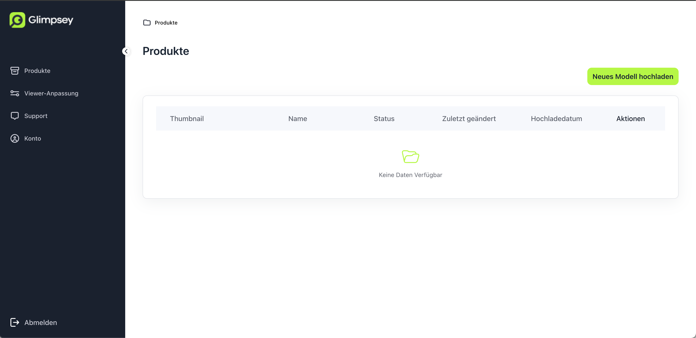
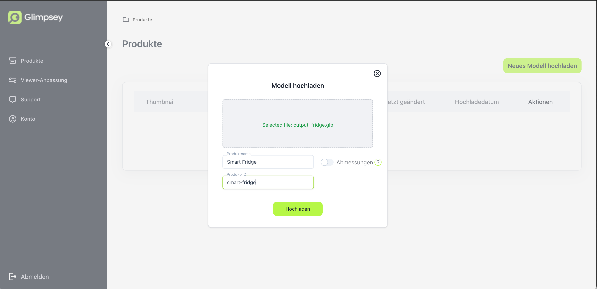
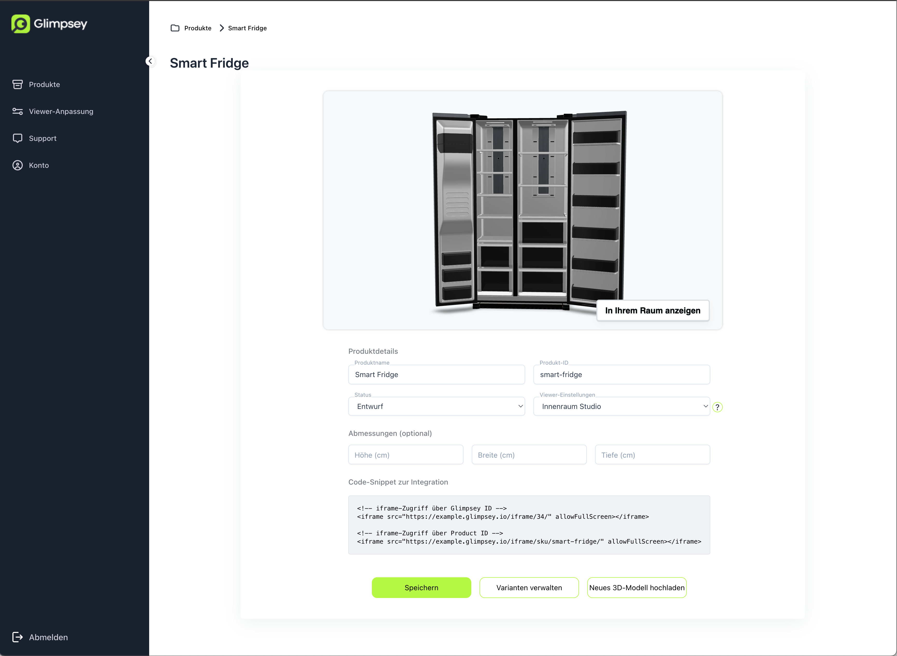

# Modelle hochladen

Logge dich in deine Glimpsey-Instanz unter `deineFirma.glimpsey.io/backoffice/` ein.

Hier wählst du **Neues Modell hinzufügen**, wählst dein GLB-Modell aus und vergibst einen *Produktnamen*. Dieser Name ist
nur für dich zur Organisation und wird deinen Kunden nicht angezeigt. 

Die *Produkt-Id* ist optional. Sobald du aber
mehr als 1-2 Produkte hast, solltest du sie angeben und auf etwas setzen, dass du auch intern in deinem Shop
verwendest. So kannst du später automatisch die URL für den Viewer erzeugen und muss diesen nicht manuell jedem
Produkt hinzufügen. 

Die *Abmessungen* werden nur benötigt, wenn dein Modell nicht korrekt angelegt wurde. Normalerweise werden die Modelle
von 3D-Artists mit 1 Einheit = 1m angelegt. Wenn dieses nicht der Fall, weil das Modell z.B. AI-generiert ist, kannst du
hier die Abmessungen angeben und das Modell wird nach dem Upload entsprechend skaliert.

Wenn man nun in die Bearbeiten-Ansicht für das neue Produkt geht (das _Stift_-Icon auf der Produkt-Tabelle), sieht man alle Details des Produkt.

Der unterste Abschnitt _Code-Snippet zur Integration_ enthält nun alles, was wir zur [Integration in unseren Shop](shop_integration.md) benötigen.
